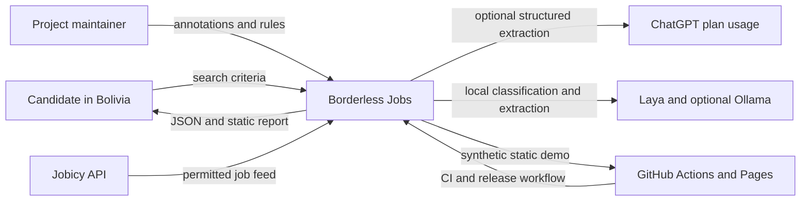
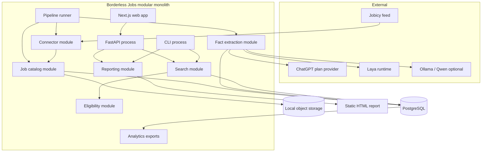
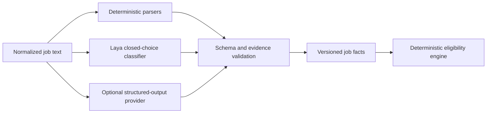

# Borderless Jobs — Architecture

Status: proposed and approved for implementation  
Last updated: 2026-09-30  
Primary launch market: technology candidates working from Bolivia  

## 1. Executive summary

Borderless Jobs turns remote job listings into evidence-backed answers to a more useful question:

> Can a candidate actually perform this job from Bolivia?

The product ingests permitted job feeds, preserves their history, extracts structured facts, and evaluates those facts with a deterministic policy engine. Every result is one of `YES`, `NO`, or `UNCERTAIN` and includes the exact evidence and rule trace that produced it.

The architecture is a local-first modular monolith with three independently runnable
processes:

- a Python ingestion and enrichment worker;
- a FastAPI read and report interface;
- a lightweight Next.js web interface.

The CLI is a distributed command adapter over the same application interfaces, not a
fourth long-running service. The first complete product slice is headless: a typed Python
use case and CLI generate a versioned `SearchReport` JSON document and a static HTML
report without a database. PostgreSQL and live ingestion are added behind those proven
interfaces for the local MVP. The same application modules later power the HTTP
interface, dashboard, and MCP adapter. PostgreSQL is the operational system of record.
AI providers extract facts; they never decide eligibility.

This design optimizes for one developer, zero infrastructure budget during the MVP, high
testability, and a credible path to production without pretending that the MVP is already
a distributed system. Delivery is driven by verified milestones rather than a fixed
calendar.

## 2. Product scope

### 2.1 MVP outcomes

The MVP must:

- ingest Jobicy on a repeatable schedule without creating duplicates;
- retain raw source provenance and normalized change history;
- search jobs by role and candidate country;
- evaluate geography, engagement mechanism, and timezone compatibility;
- return `YES`, `NO`, or `UNCERTAIN` with evidence, missing facts, and applied rules;
- generate a versioned JSON report and a shareable static HTML report;
- expose the same behavior through a CLI, then FastAPI and a lightweight dashboard;
- run its mandatory test suite without network access or an AI account;
- publish a synthetic-data demonstration through GitHub Pages;
- measure extraction and decision quality against a versioned, human-reviewed eval set.

### 2.2 Explicit non-goals for the MVP

The first release will not include:

- user accounts, saved searches, favorites, or notifications;
- CV or GitHub profile matching;
- legal, immigration, payroll, or tax advice;
- Wellfound scraping;
- multilingual ingestion beyond English;
- a publicly hosted API or database;
- Redis, Prefect, LangGraph, Kubernetes, or microservices;
- automatic fuzzy merges with irreversible effects;
- a claim that a local classifier alone provides production-grade extraction.

### 2.3 Success targets

The initial product targets are:

- at least 500 active jobs indexed when the source feed permits it;
- at least 100 manually reviewed eval examples;
- greater than 90% precision for emitted `YES` and `NO` verdicts;
- at least 80% coverage of examples that contain enough information to decide;
- no duplicate records after replaying the same ingestion batch;
- an evidence-backed trace for every verdict;
- p95 search latency below 500 ms on the supported local development profile, excluding ingestion and model inference.

Precision takes precedence over coverage. The product should emit `UNCERTAIN` rather than inventing permission.

## 3. Architectural drivers

The design follows these constraints:

1. **Trust requires provenance.** A verdict without quoted evidence, source time, extractor version, and rule version is not a product result.
2. **AI output is fallible.** Extracted facts are candidates for validation; eligibility is deterministic and replayable.
3. **The product is local-first.** Development and the full demo work without paid infrastructure.
4. **The implementation is operated by one person.** Every dependency must earn its operational cost.
5. **Source permissions differ.** Attribution, polling, retention, and redistribution rules are data carried by each connector.
6. **Interfaces must remain small.** Complex behavior belongs in deep modules, not in FastAPI routes, CLI commands, Prefect flows, or React components.
7. **The first output is an artifact.** A canonical report can be rendered as HTML now and served interactively later.

## 4. System context



The system does not rely on a remote AI provider for deterministic tests or basic operation. When no optional provider is configured, model-dependent facts are marked unavailable and the decision engine uses known facts or returns `UNCERTAIN`.

## 5. Runtime architecture



The diagram shows modules, not deployable microservices. The Python modules live in one codebase and one release unit. The runner, API, and CLI are separate entry points so workload isolation can be introduced without rewriting the domain.

## 6. Deep modules and seams

The core is designed as a small set of deep modules. Callers learn a narrow interface while normalization, validation, evidence handling, and persistence details remain local to each implementation.

### 6.1 Connector module

Purpose: turn a source-specific feed into source-neutral envelopes while enforcing the source policy.

Primary interface:

```python
class JobSourceConnector(Protocol):
    def fetch(self, checkpoint: SourceCheckpoint | None) -> FetchBatch: ...
```

`FetchBatch` contains raw items, the next checkpoint, fetch metadata, and the effective source policy. The interface hides pagination, HTTP retry behavior, rate limits, attribution fields, and source-specific schemas.

Initial adapters:

- `JobicyConnector` for live development;
- `FixtureConnector` for deterministic tests and demos.

Later adapters include Remotive and explicitly allowlisted Greenhouse or Lever boards. A connector cannot bypass the catalog module and write normalized jobs directly.

### 6.2 Job catalog module

Purpose: own source provenance, normalization, idempotency, version history, closure detection, and duplicate candidates.

Primary interface:

```python
class JobCatalog:
    def ingest(self, batch: FetchBatch) -> IngestionResult: ...
    def mark_missing(self, source: SourceId, observed_at: datetime) -> ClosureResult: ...
```

The module performs content hashing, stores the raw snapshot, derives a normalized posting version, records field-level changes, and emits enrichment work only for new or changed content. Replaying the same batch is a no-op.

### 6.3 Fact extraction module

Purpose: produce validated facts and evidence spans from a normalized posting.

Primary interface:

```python
class FactExtractor(Protocol):
    def extract(self, document: JobDocument, schema: ExtractionSchema) -> ExtractionResult: ...
```

The external seam is provider-neutral. Internally, the implementation can combine deterministic parsers, Laya decisions, and a generative extractor. Provider details do not leak into the catalog or eligibility interfaces.

Every fact includes:

- a typed value;
- confidence or decision score where meaningful;
- an exact evidence quote and character offsets;
- the method and provider that produced it;
- schema, prompt, model, and runtime versions;
- validation warnings.

An evidence quote is accepted only if it can be found in the preserved source text after defined normalization. Invalid evidence is discarded and recorded as an extraction failure.

### 6.4 Eligibility module

Purpose: evaluate already-extracted facts for a candidate country at a point in time.

Primary interface:

```python
class EligibilityEngine:
    def evaluate(
        self,
        facts: JobFacts,
        candidate: CandidateContext,
        policy_version: PolicyVersion,
        as_of: datetime,
    ) -> EligibilityAssessment: ...
```

This is the highest-integrity module. It is pure Python, performs no I/O, makes no model calls, and returns a value rather than mutating storage. Tests exercise the same interface used by production callers.

### 6.5 Search module

Purpose: hide query construction, ranking, pagination, and the relationship between jobs and current assessments.

The search module owns `SearchSpecification` and search-result contracts. It depends on
domain values but does not expose database query objects.

Primary interface:

```python
class JobSearch:
    def search(self, specification: SearchSpecification) -> SearchResultPage: ...
```

Role matching starts with normalized categories and text search. Embeddings are not required for the MVP. Search results always state the assessment time and version.

### 6.6 Reporting module

Purpose: create the canonical report and derive presentation artifacts.

The reporting module owns the public, versioned `SearchReport` contract. It consumes
search results and eligibility assessments; the domain module does not depend on this
presentation-facing schema.

Primary interfaces:

```python
class ReportBuilder:
    def build(self, specification: SearchSpecification) -> SearchReport: ...

class ReportRenderer(Protocol):
    def render(self, report: SearchReport) -> RenderedArtifact: ...
```

Initial renderer adapters are JSON and static HTML. The dashboard reads equivalent response objects through FastAPI; it does not reimplement scoring or explanation logic.

### 6.7 Application entry points

Worker and FastAPI entry points are Python processes; the Next.js application is the
read-only web process. CLI and future MCP commands are thin distributed adapters rather
than additional services. All adapters validate transport concerns, invoke one use case,
and translate its result. They do not contain eligibility rules, provider prompts, SQL
queries, or source parsing.

## 7. Eligibility semantics

### 7.1 Three dimensions

Each assessment exposes:

- `geography`: whether the candidate country is included;
- `engagement`: whether a supported employment mechanism is stated or reasonably established;
- `timezone`: whether explicit working-hour constraints are compatible.

Each dimension can be `PASS`, `FAIL`, `UNKNOWN`, or `NOT_APPLICABLE` internally.

The global result is derived as follows:

- any applicable `FAIL` produces `NO`;
- no `FAIL` and at least one required `UNKNOWN` produces `UNCERTAIN`;
- all applicable dimensions `PASS` or `NOT_APPLICABLE` produces `YES`.

### 7.2 Geographic precedence

Rules are named, versioned, ordered, and included in the trace. The initial precedence is:

1. explicit exclusion of Bolivia produces `NO`;
2. an explicit allowlist that excludes Bolivia produces `NO`;
3. explicit inclusion of Bolivia produces `YES` for geography;
4. inclusion of a region whose maintained membership contains Bolivia produces `YES` for geography;
5. `worldwide` or an approved equivalent produces `YES` for geography;
6. `remote` without location evidence produces `UNCERTAIN`.

A more specific restriction overrides a broad claim. Irreconcilable evidence is not silently ordered; it produces `UNCERTAIN` and an annotation candidate.

### 7.3 Geographic reference data

Country identities use ISO 3166 codes. Regional aliases such as `LATAM`, `South America`, and `Americas` resolve through reviewed, versioned data files with explicit country membership. Marketing phrases such as `Americas-friendly` are not treated as authorization without supporting language.

### 7.4 Timezone policy

No stated timezone constraint is non-blocking. A mandatory overlap is evaluated at the report's `as_of` time using an IANA timezone and daylight-saving rules for the required zone. An impossible mandatory overlap produces `NO`; a vague preference produces `UNCERTAIN` with the ambiguity shown.

### 7.5 Engagement and visa policy

An explicitly permitted worldwide contractor arrangement or an EOR known to cover Bolivia passes the engagement dimension. Employment restricted to another country's payroll or work authorization fails it. Visa requirements matter only when relocation or work in another jurisdiction is required. Accepted geography without a discernible engagement mechanism remains `UNCERTAIN`.

These outputs summarize listing evidence. They are not legal advice.

## 8. AI extraction architecture



### 8.1 Provider roles

Deterministic parsers handle explicit country names, known region aliases, timezones, currency, salary ranges, and common contractual phrases.

Laya may handle bounded decisions for which the valid choices are known in advance, such
as:

- whether a location restriction is present;
- whether contractor engagement is explicitly allowed;
- which remote-scope class best matches the text.

Laya is not used to generate arbitrary skill lists, salaries, countries, or evidence.
Its zero-shot value is not assumed. After the first 12 protected cases exist, a
time-boxed spike compares one or two closed decisions with the deterministic baseline.
The adapter remains optional only if it meets predeclared quality and resource gates on
the supported CPU-only development profile.

The initial optional generative providers are:

- ChatGPT plan usage through `Sign in with ChatGPT` for local open-source development;
- Ollama with a small Qwen model as a local experimental baseline;
- a future paid OpenAI adapter, evaluated rather than assumed to be superior.

The runtime discovers permitted ChatGPT plan models rather than hard-coding entitlement assumptions. OAuth credentials stay local and are never available to the web frontend, committed to Git, or used by mandatory CI jobs.

### 8.2 Quality gates

Model outputs pass through Pydantic validation, vocabulary normalization, evidence verification, and contradiction checks. Invalid fields become unknown; they do not cause a permissive fallback.

The eval suite reports field-level precision, recall, and F1; evidence validity; exact-match rates for closed fields; global verdict precision and coverage; latency; and cost when applicable. Results are sliced by source, text length, rule family, and verdict.

Model-dependent metrics are reported separately from deterministic software tests. A model regression cannot be hidden by aggregate application coverage.

### 8.3 Why LangGraph is deferred

MVP extraction is a bounded sequence, not a stateful agent. LangGraph would duplicate application orchestration without providing needed memory, tool-selection loops, or human-interrupt recovery. It becomes a candidate only if CV/GitHub matching evolves into a long-running workflow that asks clarifying questions, pauses for review, and resumes across sessions.

## 9. Data architecture

### 9.1 Data layers

The operational data follows four conceptual layers:

- **Raw:** immutable source payloads and fetch metadata, retained privately according to source policy.
- **Normalized:** stable job identity, company, title, location text, canonical URL, publication state, and version history.
- **Derived:** extracted facts, evidence, eligibility assessments, rule traces, and reports.
- **Analytical:** dbt models for ingestion quality, freshness, extraction metrics, decision coverage, and source drift.

Raw and normalized writes are owned by the catalog module. Derived writes are owned by extraction and assessment application use cases. dbt is read-oriented and must not populate operational tables used to serve the product.

### 9.2 Core records

The first schema should include:

- `source` and `source_policy`;
- `fetch_run` and `fetch_checkpoint`;
- `raw_job_snapshot` with content hash and a private PostgreSQL payload;
- `job` as the stable cross-version identity;
- `job_source_identity` for source-specific identifiers;
- `job_version` for normalized changes;
- `extraction_run` and `extracted_fact`;
- `evidence_span`;
- `eligibility_assessment` and `rule_evaluation`;
- `search_report` with schema and policy versions;
- `eval_case`, or file-backed eval case identifiers linked to recorded runs.

Raw payloads are stored privately in PostgreSQL for the MVP. A storage interface is
introduced only when a second real adapter, such as object storage, is implemented.
Each immutable job version also stores canonical normalized text and its normalization
version. Evidence offsets address that canonical text, never the raw HTML; the exact
excerpt is retained alongside the offsets.

### 9.3 History and closure

A changed content hash creates a new immutable `job_version`; unchanged reingestion only updates observation metadata. A job becomes inactive when the source explicitly closes it, it expires, or it is absent from two consecutive successful source ingestions. Historical reports retain the state and evidence used when they were generated.

### 9.4 Deduplication

Within Jobicy, the external identifier is authoritative. Cross-source matching and
`duplicate_candidate` records are deferred until a second connector exists. At that
point, exact candidates may use normalized company, title, location, canonical URL, and
publication timing. Fuzzy matches remain reviewable and are never merged automatically.

## 10. Source governance

Every connector declares a policy object containing:

- attribution requirements;
- canonical-link requirements;
- minimum polling interval;
- raw-data retention policy;
- public redistribution allowance;
- removal behavior;
- policy source URL and review date.

The initial live source is Jobicy, polled a few times per day and never more frequently than its documented limit. Public views include the required attribution and canonical outbound link. Remotive is the next connector and retains its distinct attribution and gating constraints. Wellfound is not scraped.

Complete raw descriptions stay private unless redistribution is clearly permitted. Public demo data is synthetic or explicitly reusable. Public evidence is limited to the minimum excerpt needed to explain a decision, with a link to the canonical source.

## 11. Canonical report

`SearchReport` is a versioned, immutable value with:

- report identifier, creation time, and schema version;
- search role, candidate country, filters, and `as_of` time;
- data freshness and source attributions;
- ordered job summaries;
- global and dimensional verdicts;
- rule identifiers, versions, and explanations;
- evidence excerpts and source links;
- missing or contradictory facts;
- extractor and model provenance;
- a disclaimer that the result is informational rather than legal advice.

Static HTML is a deterministic rendering of this value. The renderer cannot change rankings, rules, or verdicts. This makes snapshot testing straightforward and lets a future harness consume JSON without scraping presentation markup.

## 12. Interfaces for users and harnesses

### 12.1 CLI

The target interaction is:

```bash
borderless search --country BO --role data-engineer --format html --output ./report
```

The CLI prints machine-readable errors, can emit JSON to standard output, and exits non-zero for operational failures. An `UNCERTAIN` job is a valid product result, not a process error.

### 12.2 HTTP interface

The first versioned routes are expected to cover:

- `GET /v1/jobs` for filtered search;
- `GET /v1/jobs/{job_id}` for current details and evidence;
- `GET /v1/jobs/{job_id}/assessments/{country_code}`;
- `POST /v1/reports` to build a report from a search specification;
- `GET /v1/reports/{report_id}` for canonical JSON;
- `GET /health/live` and `GET /health/ready`.

The future public HTTP interface uses API keys, quotas, explicit pagination, and an OpenAPI contract. The local MVP does not require user authentication.

### 12.3 MCP adapter

After the core interfaces stabilize, an MCP server can expose `search_jobs`, `evaluate_job`, and `generate_report`. It is an adapter over application use cases, not a second implementation. A harness may decide when to call the tools, but the engine remains responsible for facts, rules, provenance, and report generation.

## 13. Repository shape

The planned monorepo layout is:

```text
apps/
  api/                  # FastAPI transport adapter
  cli/                  # Typer-based command adapter
  web/                  # Next.js presentation
packages/
  domain/               # Shared value objects and invariants
  connectors/           # Source connector interface and adapters
  catalog/              # Ingestion, source identity, versions, closure
  extraction/           # Parsers, Laya, provider adapters, validation
  eligibility/          # Pure rules and geographic policy data
  search/               # Search specification and query implementation
  reporting/            # SearchReport and renderers
pipelines/              # Runnable ingestion/enrichment commands
analytics/
  dbt/                  # Quality and product analytics
evals/                  # Schemas, JSONL cases, runners, reports
tests/
  fixtures/             # Licensed, transformed, or synthetic inputs
infra/
  docker/               # Images and local composition
  future/               # Documented cloud deployment, no live resources
docs/
  adr/                   # Architecture decision records
  architecture.md
  development-plan.md
  roadmap.md
  runtime-policy.md
```

Imports point inward toward domain values and module interfaces. Presentation and orchestration adapters may depend on application modules; the eligibility module depends on neither FastAPI, PostgreSQL, Prefect, nor a model SDK.

## 14. Local development and deployment

The primary verified development platform is Linux, with Ubuntu used in CI. The workflow
uses `uv` for Python and Docker Compose for PostgreSQL. Python entry points run natively
for fast feedback. Docker is the portability path; macOS and Windows become supported
only after they are exercised directly. A separate Compose profile builds the full
demonstration stack. Redis is absent until an interactive workload proves a queue, cache,
or distributed limiter is needed.

Every path resolves from the repository root. Compose project names, host ports,
databases, caches, and generated artifacts are namespaced by a stable worktree
identifier. Two worktrees must be able to run checks and disposable databases
concurrently without shared mutable state.

The no-budget delivery topology is:

- local API, worker, PostgreSQL, and optional model runtimes;
- GitHub Actions for validation and release builds;
- GitHub Pages for a synthetic static demonstration;
- versioned container images and a CLI package as release artifacts;
- no claim of continuous deployment for the API while no hosting target exists.

A future cloud deployment may map the same processes to Cloud Run, PostgreSQL to Cloud SQL, raw snapshots to object storage, and secrets to Secret Manager. This is a deployment adapter change, not a domain redesign.

## 15. CI/CD and test architecture

### 15.1 Pull request checks

Every pull request runs without network access to job feeds or models after locked
dependencies have been restored. Checks are enabled as their corresponding surface is
introduced:

- Python and TypeScript formatting and linting;
- strict Python type checking and TypeScript checking;
- migration validation against a disposable PostgreSQL instance;
- unit and property tests for domain, normalization, and rules;
- integration tests for repositories and recorded connector contracts;
- FastAPI OpenAPI and CLI contract tests;
- a small deterministic smoke eval;
- frontend unit tests and one critical Playwright flow;
- dependency and secret scanning.

Behavior-focused tests are required with every executable task. Eligibility reaches 90%
branch coverage before the local MVP; backend coverage reaches 80% before the portfolio
release. Thresholds apply progressively so empty scaffolding does not incentivize
low-value tests. Coverage is a guardrail, not a substitute for protected cases,
properties, contracts, and fault detection.

### 15.2 Main branch checks

The main branch runs the full deterministic suite, builds the web application and container images, generates the synthetic report, and publishes versioned eval results. The Pages deployment consumes only synthetic or explicitly reusable data.

### 15.3 Optional model evals

Laya, Ollama, and ChatGPT plan evals run manually or on a trusted local runner. They are not required for ordinary pull requests. A model change records before-and-after metrics and requires review when critical verdict precision falls or a protected eval case changes.

### 15.4 Releases

A version tag produces immutable images, the CLI package, database migration bundle, checksums, release notes, and the static demo. Image signing can be added when a registry is selected. A dormant cloud deployment job must not be represented as active CD.

## 16. Observability

MVP observability consists of:

- structured JSON logs with `run_id`, `job_id`, `source`, and `report_id` correlation fields;
- pipeline run records with counts, checkpoints, failures, and durations;
- a small set of Prometheus-compatible counters and histograms when the API is added;
- extraction latency, validation failure, evidence failure, and verdict coverage metrics;

OpenTelemetry, Grafana, and Langfuse are deferred until a measured diagnostic need
justifies their dependency and operational cost. Observability libraries must not be
imported by the pure eligibility implementation.

## 17. Security and privacy

The MVP follows these rules:

- OAuth and model credentials stay in an operating-system-protected local store where available, with a documented file-based development fallback;
- secrets never enter reports, logs, fixtures, browser bundles, or Git history;
- source HTML is treated as untrusted input and sanitized before rendering;
- external URLs are validated and rendered with safe link attributes;
- generated static reports contain no private raw payloads or OAuth data;
- database roles separate migrations from runtime access when deployed;
- dependency updates, secret detection, and static analysis run in CI;
- the future CV/GitHub phase requires explicit consent, purpose limitation, export, deletion, and retention policies before accepting personal data.

Job descriptions are also untrusted prompt input. Extraction prompts delimit source text, disable tool use, enforce a schema, and never execute instructions found in a listing.

### 17.1 Software supply chain

The standard library and existing dependencies are preferred. Every new direct
dependency must justify its purpose, maintenance, license, provenance, and transitive
impact. Base runtime dependencies stay minimal; development, AI, and observability
dependencies live in separate locked groups.

Lockfiles are committed and immutable installs are used in CI. Dependency changes receive
an explicit review and vulnerability/license scan. Automated update pull requests never
merge without the same tests and review as application changes.

GitHub Actions use the smallest practical set of official or reviewed actions, pinned to
verified full commit SHAs. Workflows declare minimum permissions, use timeouts, avoid
checking out untrusted code in privileged contexts, and keep release credentials
short-lived. Container bases and release inputs are pinned by digest.

Public CLI and container releases include checksums, a software bill of materials, and
verifiable build provenance. Release verification, secret scanning, dependency review,
container scanning, and an approved-data inventory are mandatory release gates.

## 18. Evolution path

The architecture scales by replacing adapters and separating processes only when measurements justify it:

1. add Remotive through the existing connector interface;
2. introduce Prefect after multiple connectors create retries, dependencies, and operational visibility needs;
3. add Redis only for a demonstrated interactive queue, cache, or rate-limit requirement;
4. expose stable application use cases through MCP;
5. deploy stateless API and worker processes independently;
6. move private blobs to object storage;
7. add accounts and API keys when a hosted interface exists;
8. add CV/GitHub evidence as a separate personal-data module;
9. consider LangGraph only for a genuinely stateful, resumable human-in-the-loop workflow.

The modular monolith should be split only when one module needs independent scaling, ownership, security isolation, or release cadence. Code-folder boundaries alone are not a reason to create network boundaries.

## 19. Risks and mitigations

### Source instability or policy change

Mitigation: source policies are explicit, connector behavior is isolated, raw provenance is retained, and the demo does not depend on live data.

### False permissive verdicts

Mitigation: precision-first rules, hard evidence requirements, protected eval cases, dimensional results, and `UNCERTAIN` as a first-class outcome.

### Weak local model quality

Mitigation: deterministic baselines, Laya limited to bounded classifications, provider-neutral extraction, published eval results, and no production-quality claim without evidence.

### Copyright or redistribution problems

Mitigation: private raw storage, minimum public excerpts, canonical links, per-source policies, and synthetic public fixtures.

### Solo-developer overreach

Mitigation: static-report-first delivery, atomic verified tasks, milestone exit gates,
deferred infrastructure, one live source, and a strict post-MVP list.

### Framework coupling

Mitigation: application use cases and pure domain interfaces sit behind FastAPI, Next.js, model SDK, and future orchestration adapters.

## 20. Architecture decisions

The following ADRs capture the decisions that would be expensive to rediscover:

- [ADR-0001: Use a headless modular monolith](adr/0001-headless-modular-monolith.md)
- [ADR-0002: Separate fact extraction from eligibility](adr/0002-deterministic-eligibility.md)
- [ADR-0003: Use local-first, provider-neutral AI](adr/0003-local-first-ai.md)
- [ADR-0004: Encode source governance in connectors](adr/0004-source-governance.md)
- [ADR-0005: Deliver a canonical report and static site first](adr/0005-static-report-first.md)

## 21. References

External behavior and source policy assumptions were checked on 2026-09-30:

- [Jobicy remote jobs API and fair-use guidance](https://jobicy.com/jobs-rss-feed)
- [Remotive public jobs API](https://remotive.com/remote-jobs/api)
- [Wellfound terms](https://wellfound.com/terms)
- [Laya repository](https://github.com/NandhaKishorM/laya)
- [Laya model card](https://huggingface.co/convaiinnovations/laya)
- [Ollama structured outputs](https://docs.ollama.com/capabilities/structured-outputs)
- [OpenAI Sign in with ChatGPT for local open-source tools](https://developers.openai.com/siwc/token-sharing-open-source)
- [LangGraph overview](https://langchain-ai.github.io/langgraph/)
- [GitHub Actions secure use reference](https://docs.github.com/en/actions/reference/security/secure-use)
- [OWASP Software Supply Chain Security Cheat Sheet](https://cheatsheetseries.owasp.org/cheatsheets/Software_Supply_Chain_Security_Cheat_Sheet.html)
- [SLSA provenance specification](https://slsa.dev/spec/v1.2/provenance)
