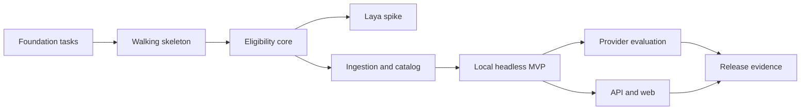

# Borderless Jobs — Step-by-step Development Plan

Status: approved for implementation  
Last updated: 2026-09-30  
Companion documents: [architecture](architecture.md), [roadmap](roadmap.md), and
[ADRs](adr/)

## 1. How to execute this plan

This is a dependency-ordered backlog, not a calendar. Estimates express focused
implementation time and help keep tasks reviewable; they are not deadlines.

### Atomic task protocol

An agent executes one ready task at a time:

1. confirm that every listed dependency is complete and green;
2. restate the single observable result and the files it expects to own;
3. add or adjust the smallest behavior-focused test;
4. implement only the behavior required by that test;
5. run the task's focused verification;
6. run the affected package's format, lint, type, and test checks;
7. update contracts, fixtures, or documentation touched by the behavior;
8. change the task status from `[ ] Pending` to `[x] Complete` only after every
   required check is green;
9. report the result, exact checks, and residual risk before selecting another task.

A failing check ends the task sequence until it is diagnosed. A task that cannot be
implemented and verified in one focused change must be split before work continues.
Concurrent agents take tasks with disjoint file ownership and integrate only green
commits.

The status directly below each task heading is the single completion record. An
unchecked task is incomplete. A checked task must have satisfied its `Verify` clause
and the universal definition of done.

### Universal definition of done

Every task must:

- preserve the accepted ADRs and the module ownership rules;
- add no unreviewed runtime dependency;
- keep deterministic tests offline after dependencies are installed;
- avoid secrets, private source payloads, and machine-specific paths;
- leave the current worktree's focused and package-level checks green;
- produce an independently reviewable diff.

Command names below describe the intended checks. The foundation tasks make their exact
spelling executable and record it in the project configuration.

## 2. Critical path

The Laya spike intentionally branches immediately after the first protected eval cases.
It cannot delay ingestion: if its budget expires or its gate fails, record the result and
continue on the critical path.

## 3. M0 — Reproducible, secure, worktree-safe foundation

### F01 — Establish repository metadata

Status: [x] Complete (2026-09-30).

Depends on: none. Estimate: 1 hour.

Result: initialize or repair Git metadata; add a minimal ignore file, line-ending policy,
MIT license, and repository-level contribution entry point.

Verify: `git status` identifies the repository; ignored local credentials, environments,
caches, reports, model weights, and worktree artifacts do not appear as untracked files.

### F02 — Record supported runtime policy

Status: [x] Complete (2026-09-30).

Depends on: F01. Estimate: 1 hour.

Result: select a stable supported Python version compatible with the chosen libraries,
record it in the project metadata, and document Linux/Ubuntu as the verified platform.

Verify: the runtime version check succeeds from a clean shell; unsupported versions fail
with an actionable message.

### F03 — Create the minimal Python workspace

Status: [x] Complete (2026-10-01).

Depends on: F02. Estimate: 2 hours.

Result: create the `uv` project, initial package namespaces, CLI entry point placeholder,
and locked base/dev dependency groups. Do not install database, web, AI, or observability
libraries before their consuming task.

Verify: locked sync, package import, and CLI `--help` succeed; a second locked sync makes
no lockfile change.

### F04 — Create the dependency admission record

Status: [x] Complete (2026-10-02).

Depends on: F03. Estimate: 1 hour.

Result: add a concise dependency policy and a change template requiring purpose,
standard-library alternative, maintenance, license, provenance, and transitive impact.

Verify: one accepted and one rejected example dependency are exercised against the
template; the runtime manifest contains only dependencies used by current code.

### F05 — Wire the fast quality loop

Status: [x] Complete (2026-10-02).

Depends on: F03. Estimate: 2 hours.

Result: configure formatting, linting, strict typing, pytest, and coverage behind a small
set of project commands.

Verify: a trivial typed unit test passes; deliberate format, type, and test failures are
each detected before their fixture is removed.

### F06 — Add architectural import checks

Status: [x] Complete (2026-10-02).

Depends on: F05. Estimate: 2 hours.

Result: encode inward dependency rules, especially the purity of `eligibility` and the
separation of adapters from application modules.

Verify: the legal empty package graph passes; a temporary forbidden framework import in
`eligibility` fails the check.

### F07 — Namespace worktree resources

Status: [x] Complete (2026-10-02).

Depends on: F03. Estimate: 2 hours.

Result: derive a safe, stable worktree identifier and use it for generated directories,
Compose project names, ports, database names, and caches without absolute paths.

Verify: identifiers are deterministic, shell-safe, and distinct for two checkout paths;
tests cover long names and punctuation.

### F08 — Add PostgreSQL development composition

Status: [x] Complete (2026-10-02).

Depends on: F07. Estimate: 2 hours.

Result: add a digest-pinned PostgreSQL service with health check, non-default local
credentials, named per-worktree storage, and a disposable test profile.

Verify: start, readiness, connection, stop, and clean recreation work in one worktree;
no port or container name is globally hard-coded.

### F09 — Establish migration plumbing

Status: [x] Complete (2026-10-02).

Depends on: F08. Estimate: 2 hours.

Result: add the selected minimal database and migration dependencies, configuration, and
an empty baseline migration without inventing the catalog schema.

Verify: upgrade from empty, downgrade to empty, and upgrade again succeed against a
disposable database.

### F10 — Add least-privilege CI

Status: [x] Complete (2026-10-02).

Depends on: F05, F09. Estimate: 3 hours.

Result: create backend quality and migration jobs with explicit read-only default
permissions, concurrency cancellation, timeouts, locked installs, and official actions
pinned to verified full commit SHAs.

Verify: workflow syntax and action pins are checked locally; CI runs the same commands as
development and requires no feed, model, or application secret.

### F11 — Add supply-chain and secret gates

Status: [x] Complete (2026-10-02).

Depends on: F04, F10. Estimate: 3 hours.

Result: enable dependency review, vulnerability auditing, secret scanning, license
inventory, and automated update PRs without automatic merging.

Verify: safe fixtures pass; synthetic secret and vulnerable-dependency fixtures are
detected without committing a usable credential.

### F12 — Prove concurrent worktrees

Status: [x] Complete (2026-10-04).

Depends on: F07, F08, F10. Estimate: 2 hours.

Result: document and exercise two worktrees running fast checks and disposable databases
concurrently.

Verify: resource identifiers, ports, databases, caches, and generated artifacts remain
separate; stopping one environment does not affect the other.

### F13 — Rehearse clean setup

Status: [x] Complete (2026-10-04).

Depends on: F11, F12. Estimate: 2 hours.

Result: write the exact clean-checkout setup and troubleshooting path.

Verify: execute every command from a fresh worktree with empty local caches where
practical; record elapsed time and any prerequisite not installed by the project.

## 4. M1 — Headless walking skeleton

### W01 — Declare package ownership

Status: [x] Complete (2026-10-04).

Depends on: F13. Estimate: 1 hour.

Result: create package-level documentation for `domain`, `eligibility`, `search`,
`reporting`, and CLI ownership, with public import surfaces kept intentionally small.

Verify: import checks pass and no package exposes infrastructure or framework types.

### W02 — Define foundational value objects

Status: [x] Complete (2026-10-04).

Depends on: W01. Estimate: 2 hours.

Result: add immutable country code, evidence, fact provenance, dimensional decision,
global verdict, policy version, and schema version values with validation.

Verify: construction, equality, invalid input, and serialization tests pass.

### W03 — Define the search contract

Status: [x] Complete (2026-10-04).

Depends on: W02. Estimate: 1.5 hours.

Result: place `SearchSpecification` and result ordering primitives in `search`.

Verify: normalization, invalid filters, explicit pagination, and round-trip tests pass.

### W04 — Define the canonical report

Status: [x] Complete (2026-10-04).

Depends on: W02, W03. Estimate: 2 hours.

Result: place the immutable, versioned `SearchReport` and job-result schema in
`reporting`, including freshness, evidence, trace, unknowns, and attribution.

Verify: schema and policy versions survive a deterministic serialization round trip.

### W05 — Build a synthetic in-memory search adapter

Status: [x] Complete (2026-10-05).

Depends on: W03. Estimate: 1.5 hours.

Result: return a fixed ordered set of synthetic jobs and hand-built facts through the
real search interface.

Verify: role and country filtering, stable ordering, empty results, and pagination pass
without database or network access.

### W06 — Add the minimal report-building use case

Status: [x] Complete (2026-10-05).

Depends on: W04, W05. Estimate: 2 hours.

Result: turn a search result into `SearchReport` through one application interface,
using an explicitly passed clock and versions.

Verify: a frozen clock produces byte-stable report data; missing evidence stays visible.

### W07 — Add the JSON renderer

Status: [x] Complete (2026-10-05).

Depends on: W06. Estimate: 1 hour.

Result: serialize canonical JSON with stable field names and explicit schema version.

Verify: golden contract, UTF-8, deterministic ordering, and stdout behavior pass.

### W08 — Add the safe static HTML renderer

Status: [x] Complete (2026-10-05).

Depends on: W06. Estimate: 2.5 hours.

Result: render an offline HTML artifact from `SearchReport` without business decisions
or executable source markup.

Verify: snapshot, escaping, unsafe URL, script injection, accessibility landmark, and
offline-open tests pass.

### W09 — Wire the CLI walking skeleton

Status: [x] Complete (2026-10-05).

Depends on: W07, W08. Estimate: 2 hours.

Result: implement the target search command, JSON/stdout and HTML/output modes, and
machine-readable operational errors.

Verify: valid, invalid, empty, `UNCERTAIN`, and write-failure cases have documented exit
codes; no database or network is needed.

### W10 — Lock the end-to-end preview

Status: [x] Complete (2026-10-05).

Depends on: W09. Estimate: 1.5 hours.

Result: add one deterministic journey from CLI arguments to both report artifacts.

Verify: run from a clean worktree and compare JSON semantics with HTML-visible content;
all M1 exit conditions are demonstrated.

## 5. M2 — Deterministic eligibility core

### D01 — Add reviewed geographic reference data

Status: [x] Complete (2026-10-06).

Depends on: W02. Estimate: 2 hours.

Result: add versioned ISO country identities, Bolivia, LATAM, South America, Americas,
worldwide aliases, and documented membership provenance.

Verify: schema, uniqueness, alias collision, membership, and version tests pass.

### D02 — Implement explicit geographic inclusion

Status: [x] Complete (2026-10-06).

Depends on: D01. Estimate: 2 hours.

Result: pass geography for explicit Bolivia, reviewed containing regions, and approved
worldwide language with traceable rule identifiers.

Verify: focused examples cover aliases, casing, boundaries, and unsupported marketing
phrases.

### D03 — Implement exclusion precedence

Status: [x] Complete (2026-10-06).

Depends on: D02. Estimate: 2 hours.

Result: fail explicit Bolivia exclusion and allowlists that omit Bolivia; make specific
restrictions dominate broad inclusions.

Verify: example and property tests prove that adding a broader inclusion cannot turn a
protected exclusion into a pass.

### D04 — Implement contradiction handling

Status: [x] Complete (2026-10-06).

Depends on: D03. Estimate: 1.5 hours.

Result: irreconcilable evidence yields unknown geography and an annotation candidate
instead of relying on incidental rule order.

Verify: contradictory evidence is permutation-invariant and never produces `YES`.

### D05 — Implement engagement policy

Status: [x] Complete (2026-10-06).

Depends on: W02. Estimate: 2.5 hours.

Result: evaluate supported contractor/EOR facts, restricted payroll/work authorization,
and missing mechanisms with versioned rules.

Verify: pass, fail, unknown, conflicting mechanism, and non-legal-advice cases pass.

### D06 — Implement timezone policy

Status: [x] Complete (2026-10-06).

Depends on: W02. Estimate: 2.5 hours.

Result: evaluate explicit mandatory overlap at passed `as_of` time using IANA zones;
absence is non-blocking and vague preferences stay unknown.

Verify: daylight-saving boundaries, overnight windows, impossible overlap, preference,
and no-constraint cases pass with a frozen clock.

### D07 — Compose the global verdict

Status: [x] Complete (2026-10-06).

Depends on: D04, D05, D06. Estimate: 1.5 hours.

Result: apply the documented three-valued composition across applicable dimensions.

Verify: exhaustive generated combinations match the truth table.

### D08 — Produce complete rule traces

Status: [x] Complete (2026-10-06).

Depends on: D07. Estimate: 2 hours.

Result: return ordered rule identifiers, versions, inputs, outcomes, explanations, and
missing facts without reading presentation templates.

Verify: every verdict path has at least one trace entry and stable serialization.

### D09 — Protect the first 12 reviewed cases

Status: [x] Complete (2026-10-06).

Depends on: D08. Estimate: 3 hours.

Result: create and independently review critical geography, engagement, timezone, and
contradiction cases separated from implementation fixtures.

Verify: annotation schema validation, duplicate detection, and deterministic smoke eval
pass; changing a protected verdict fails CI.

### D10 — Enforce core quality gates

Status: [x] Complete (2026-10-06).

Depends on: D09. Estimate: 2 hours.

Result: reach the branch-coverage target through meaningful boundary behavior and prove
the module's purity.

Verify: eligibility has at least 90% branch coverage; mutation or equivalent fault checks
kill representative precedence and composition defects.

## 6. Early optional branch — Laya decision spike

### L01 — Predeclare the experiment

Status: [ ] Pending.

Depends on: D09. Estimate: 1 hour.

Result: select one or two bounded decisions, the deterministic baseline, frozen cases,
precision/recall and protected-case gates, memory ceiling, and the 4–6 hour stop budget.

Verify: the experiment document can decide keep/defer without changing its criteria
after results are seen.

### L02 — Isolate the Laya runtime

Status: [ ] Pending.

Depends on: L01. Estimate: 1.5 hours.

Result: add Laya only to an optional locked dependency group and a thin experimental
adapter; model weights remain outside Git and mandatory CI.

Verify: base installation and test suite remain unchanged; missing weights produce an
actionable skip rather than a failure.

### L03 — Run the bounded comparison

Status: [ ] Pending.

Depends on: L02. Estimate: 2 hours.

Result: execute identical cases through deterministic and Laya paths while recording
model revision, runtime, latency, memory, scores, and failures.

Verify: outputs are schema-valid and reproducible enough to compare; no Laya result can
write an eligibility verdict.

### L04 — Record the keep/defer decision

Status: [ ] Pending.

Depends on: L03. Estimate: 1 hour.

Result: publish measured results and either retain a gated optional adapter or remove it
from the active runtime plan while preserving the report.

Verify: the conclusion follows the predeclared gate; the critical path is green with
Laya absent.

## 7. M3 — Governed ingestion and auditable catalog

Active milestone as of 2026-10-08. The optional Laya branch remains pending
because local RAM is insufficient; it does not block ingestion.

### I01 — Verify and encode Jobicy governance

Status: [x] Complete (2026-10-08).

Depends on: D10. Estimate: 2 hours.

Result: record authoritative policy URL, review date, polling, attribution, canonical
link, retention, redistribution, and removal rules as versioned data.

Verify: schema and policy tests reject missing provenance or a renderer-incompatible
policy; uncertain permissions default to private retention.

### I02 — Define connector contracts

Status: [x] Complete (2026-10-08).

Depends on: I01. Estimate: 1.5 hours.

Result: define checkpoint, fetch metadata, raw envelope, source policy, batch, and
failure types without HTTP-client types crossing the seam.

Verify: construction, pagination/checkpoint invariants, size limits, and serialization
tests pass.

### I03 — Implement the fixture connector

Status: [x] Complete (2026-10-08).

Depends on: I02. Estimate: 2 hours.

Result: load licensed, transformed, or synthetic recorded batches through the production
connector interface.

Verify: complete, empty, malformed, repeated, and checkpointed fixtures pass the shared
contract without network access.

### I04 — Define canonical text normalization

Status: [x] Complete (2026-10-08).

Depends on: I03. Estimate: 3 hours.

Result: preserve the private raw payload and produce immutable canonical plain text with
a normalization version. Evidence offsets refer only to that canonical text.

Verify: malformed HTML, entities, Unicode, whitespace, embedded script, repeated text,
and size-limit cases have exact deterministic outputs.

### I05 — Implement the Jobicy mapper

Status: [x] Complete (2026-10-09).

Depends on: I04. Estimate: 2.5 hours.

Result: map recorded Jobicy responses into source-neutral envelopes while retaining raw
metadata and policy.

Verify: shared connector contract covers missing optional fields, schema drift, invalid
URLs, oversized fields, and stable content hashes.

### I06 — Add the opt-in live transport

Status: [x] Complete (2026-10-09).

Depends on: I05. Estimate: 2.5 hours.

Result: fetch with timeouts, response limits, bounded retries with jitter, user agent,
poll interval enforcement, and safe URL/TLS defaults.

Verify: fake transport covers success, timeout, retryable/non-retryable status, invalid
content type, oversize response, and cancellation; real smoke test is manual.

### C01 — Migrate source and fetch records

Status: [ ] Pending.

Depends on: F09, I02. Estimate: 2.5 hours.

Result: add source, policy version, fetch run, and checkpoint tables with constraints.

Verify: upgrade/downgrade/re-upgrade and repository round trips pass on PostgreSQL.

### C02 — Migrate raw and normalized job records

Status: [ ] Pending.

Depends on: C01, I04. Estimate: 3 hours.

Result: add raw snapshots in PostgreSQL, source identity, stable job, immutable version,
canonical text, normalized hash, observation, and publication state.

Verify: constraints prevent orphan records, duplicate source identity, invalid versions,
and mutable historical content.

### C03 — Ingest one batch transactionally

Status: [ ] Pending.

Depends on: C02, I03. Estimate: 3 hours.

Result: implement `JobCatalog.ingest` as the sole path from connector envelopes to raw
and normalized records.

Verify: success persists complete provenance; injected failure leaves no partial batch.

### C04 — Enforce idempotence and version history

Status: [ ] Pending.

Depends on: C03. Estimate: 2.5 hours.

Result: unchanged replay updates observation metadata without a new version; one
normalized change creates exactly one immutable version.

Verify: repeated, reordered, interrupted, and concurrent replay tests pass.

### C05 — Implement closure observations

Status: [ ] Pending.

Depends on: C04. Estimate: 2 hours.

Result: explicit closure/expiry or absence from two complete successful batches marks a
job inactive without erasing history.

Verify: failed or partial fetches never count as missing observations; reappearance has
documented behavior.

### C06 — Expose one-shot pipeline summaries

Status: [ ] Pending.

Depends on: C05, I06. Estimate: 2 hours.

Result: add fixture and opt-in live ingestion commands with run identifier, checkpoint,
counts, duration, and categorized failures.

Verify: success, no-op replay, partial item rejection, full rollback, and resume cases
return documented exit codes and summaries.

### C07 — Rehearse catalog recovery

Status: [ ] Pending.

Depends on: C06. Estimate: 2 hours.

Result: document and test safe rerun after interruption and migration rollback limits.

Verify: a killed fixture ingestion can be rerun without duplicate state; history explains
every observed change and inactive transition.

## 8. M4 — Local headless MVP

### E01 — Define extracted facts and evidence validation

Status: [ ] Pending.

Depends on: C04, D08. Estimate: 2.5 hours.

Result: define typed facts, confidence, canonical offsets, method/provider provenance,
schema/runtime versions, and validation warnings.

Verify: invalid types, vocabulary, offsets, version references, and missing provenance
are rejected or converted to explicit unknowns.

### E02 — Parse explicit geography

Status: [ ] Pending.

Depends on: E01, D01. Estimate: 3 hours.

Result: extract country and reviewed-region mentions with exact evidence and boundaries.

Verify: aliases, overlapping names, negation adjacency, Unicode, and false substring
matches pass focused fixtures.

### E03 — Resolve geographic restrictions

Status: [ ] Pending.

Depends on: E02. Estimate: 2.5 hours.

Result: distinguish inclusion, exclusion, allowlists, remote-only language, and
contradictory statements without emitting eligibility.

Verify: rule inputs produced from parser facts match the protected cases.

### E04 — Parse engagement facts

Status: [ ] Pending.

Depends on: E01. Estimate: 2.5 hours.

Result: extract explicit contractor, EOR, payroll, authorization, visa, and relocation
statements with evidence.

Verify: phrase variants, negation, multiple mechanisms, and ambiguous language pass.

### E05 — Parse timezone facts

Status: [ ] Pending.

Depends on: E01. Estimate: 2.5 hours.

Result: extract IANA zones, UTC offsets, mandatory overlap windows, and preference
language without evaluating compatibility.

Verify: malformed offsets, ranges, daylight-saving wording, overnight intervals, and
preference/requirement distinctions pass.

### E06 — Parse descriptive metadata

Status: [ ] Pending.

Depends on: E01. Estimate: 3 hours.

Result: extract salary/currency, seniority, skills, and common role metadata as report
facts, isolated from eligibility-critical parsers.

Verify: malformed ranges, locale formats, repeated skills, missing units, and false
positives pass.

### E07 — Compose deterministic extraction

Status: [ ] Pending.

Depends on: E03, E04, E05, E06. Estimate: 2 hours.

Result: run parsers behind `FactExtractor`, merge compatible facts, retain
contradictions, and validate every evidence span.

Verify: invalid spans are discarded with diagnostics; parser order does not change the
canonical result.

### E08 — Persist extraction and assessment runs

Status: [ ] Pending.

Depends on: E07, C04. Estimate: 3 hours.

Result: migrate and store extraction runs, facts, evidence, assessments, and rule
evaluations keyed by job, document, schema, extractor, and policy versions.

Verify: rerunning the same version is idempotent; changed extractor or policy versions
remain separately replayable.

### S01 — Implement PostgreSQL search

Status: [ ] Pending.

Depends on: E08, W03. Estimate: 3 hours.

Result: filter active current versions by role, country context, verdict, seniority,
timezone, and engagement with stable pagination and simple text/category ranking.

Verify: query semantics, stable tie-breaking, empty pages, invalid cursors, and bounded
query count pass against seeded PostgreSQL.

### S02 — Build reports from persisted search

Status: [ ] Pending.

Depends on: S01, W06. Estimate: 2.5 hours.

Result: replace the synthetic adapter with persisted search while preserving the same
report-building interface and explicit `as_of`.

Verify: synthetic and database adapters produce semantically equivalent reports for the
same logical data.

### S03 — Complete the CLI filters

Status: [ ] Pending.

Depends on: S02, W09. Estimate: 2 hours.

Result: expose supported filters, pagination, freshness, and operational diagnostics
without leaking SQL or provider details.

Verify: CLI contract covers every filter, combined filters, invalid input, connection
failure, `UNCERTAIN`, and no-result success.

### S04 — Prove portable static exports

Status: [ ] Pending.

Depends on: S03. Estimate: 1.5 hours.

Result: export self-contained JSON and HTML that can be moved and opened without the
database, network, source payload, or model.

Verify: inspect and open artifacts from a temporary directory; asset, privacy, and
content-security checks pass.

### E09 — Calibrate extraction annotation

Status: [ ] Pending.

Depends on: E07, D09. Estimate: 2 hours.

Result: refine the annotation guide with extraction truth, expected decisions,
ambiguity, reviewer state, and source-policy metadata; calibrate on three existing cases.

Verify: two reviews reach agreement or record a concrete guide correction; schema,
evidence-span, and reviewer-status checks pass.

### E10 — Review eval cases 13 through 18

Status: [ ] Pending.

Depends on: E09. Estimate: 2–3 hours.

Result: add six independently reviewed cases across missing rule-family and ambiguity
slices.

Verify: schema, duplicate, leakage, evidence-span, reviewer-status, and protected-case
checks pass for the 18-case dataset.

### E11 — Review eval cases 19 through 25

Status: [ ] Pending.

Depends on: E10. Estimate: 2–3 hours.

Result: add seven independently reviewed cases that close the planned 25-case slice
coverage and freeze the first extraction baseline.

Verify: all dataset checks pass and the deterministic 25-case baseline report is
versioned.

### S05 — Close the local MVP gate

Status: [ ] Pending.

Depends on: S04, E08, E11. Estimate: 2 hours.

Result: rehearse fixture ingestion through exported Bolivia data-engineer report and
document measured latency and limitations.

Verify: all M4 exit conditions pass from a clean worktree without feed or model access.

## 9. M5 — Evaluation and optional providers

### A01 — Implement reusable eval metrics

Status: [ ] Pending.

Depends on: E11. Estimate: 3 hours.

Result: compute per-field precision/recall/F1, evidence validity, closed-field exact
match, verdict precision/coverage, latency, and configured slices.

Verify: hand-calculated metric fixtures, empty slices, unknowns, and aggregation tests
pass.

### A02 — Define the provider-neutral generative seam

Status: [ ] Pending.

Depends on: E07, A01. Estimate: 2 hours.

Result: accept canonical text and extraction schema; return untrusted candidate facts
and metadata that must pass the same validator.

Verify: no provider type reaches catalog or eligibility and no result can supply a final
verdict.

### A03 — Implement the fake provider matrix

Status: [ ] Pending.

Depends on: A02. Estimate: 2 hours.

Result: cover success, timeout, refusal, usage exhaustion, invalid schema, invalid
evidence, contradiction, and cancellation.

Verify: every case becomes a valid extraction result or typed operational failure;
mandatory CI remains offline.

### A04 — Implement secure ChatGPT authorization

Status: [ ] Pending.

Depends on: A03. Estimate: 3 hours.

Result: add optional local OAuth/PKCE registration with stable host identity, validated
tokens/scopes, loopback callback, and protected credential storage fallback.

Verify: state, nonce, PKCE, callback binding, token validation, missing permission,
refresh race, revocation, and redaction tests use fake endpoints.

### A05 — Implement model discovery and inference

Status: [ ] Pending.

Depends on: A04. Estimate: 2.5 hours.

Result: discover eligible models at runtime and request schema-constrained extraction
using the selected local profile.

Verify: fake discovery/inference covers no models, entitlement failure, usage limit,
stream failure, invalid output, and successful validated facts.

### A06 — Compare providers on frozen cases

Status: [ ] Pending.

Depends on: A01, A05, L04. Estimate: 3 hours plus inference time.

Result: compare deterministic, retained Laya, ChatGPT, and any approved experimental
adapter on identical cases and slices.

Verify: reports carry prompt/schema/model/runtime versions and never combine mismatched
holdouts or silently omit failures.

### A07 — Decide whether to spike Ollama

Status: [ ] Pending.

Depends on: A06. Estimate: 1 hour.

Result: state a distinct hypothesis that current adapters cannot answer, estimated local
resource cost, and stop gate; otherwise explicitly defer Ollama.

Verify: an experiment proceeds only with a predeclared question and budget.

### A08 — Review eval cases 26 through 32

Status: [ ] Pending.

Depends on: A01. Estimate: 2–3 hours.

Result: add seven reviewed cases targeting the weakest rule-family and ambiguity slices.

Verify: dataset checks, reviewer state, slice coverage, and protected cases pass.

### A09 — Review eval cases 33 through 40

Status: [ ] Pending.

Depends on: A08. Estimate: 2–3 hours.

Result: add eight reviewed source-shaped and varied-length cases while retaining the
frozen comparison subset.

Verify: dataset checks, leakage checks, length-slice coverage, and baseline regeneration
pass.

### A10 — Review eval cases 41 through 50

Status: [ ] Pending.

Depends on: A09. Estimate: 2–3 hours.

Result: add ten reviewed cases that close the planned 50-case verdict and rule coverage.

Verify: all dataset checks pass and the versioned 50-case provider comparison baseline is
reproducible.

## 10. M6 — FastAPI and read-only web

### P01 — Add the FastAPI adapter

Status: [ ] Pending.

Depends on: S05. Estimate: 2 hours.

Result: add FastAPI only to the API extra and expose liveness/readiness with explicit
dependency wiring.

Verify: startup, shutdown, live, ready, dependency failure, and OpenAPI generation pass.

### P02 — Expose search and job details

Status: [ ] Pending.

Depends on: P01, S01. Estimate: 3 hours.

Result: implement versioned read routes with validation, pagination, structured errors,
correlation identifiers, and safe external links.

Verify: response contracts, status codes, query counts, limits, and malicious input pass.

### P03 — Expose assessments and reports

Status: [ ] Pending.

Depends on: P02, S02. Estimate: 3 hours.

Result: expose assessment and canonical report use cases without recomputing presentation
logic; equivalent requests are idempotent for fixed data and policy versions.

Verify: API, CLI, and direct use cases return semantically equivalent report values.

### P04 — Measure API behavior

Status: [ ] Pending.

Depends on: P03. Estimate: 2 hours.

Result: seed the reference dataset and measure p95 local search latency, response size,
and query counts on the supported profile.

Verify: the benchmark is reproducible and reports failure rather than hiding a missed
target.

### P05 — Scaffold the web workspace

Status: [ ] Pending.

Depends on: P03. Estimate: 2.5 hours.

Result: create a locked, strict TypeScript/Next.js workspace only now, with minimal
runtime dependencies and lint, type, unit, and build checks.

Verify: locked install is reproducible; a trivial accessible component passes all checks;
dependency admission records cover every direct package.

### P06 — Build search and mixed results

Status: [ ] Pending.

Depends on: P05. Estimate: 3 hours.

Result: implement country/role search, supported filters, URL-backed state, loading,
error, empty, and mixed-verdict views.

Verify: component tests cover every state and convey verdicts without color alone.

### P07 — Build evidence details and methodology

Status: [ ] Pending.

Depends on: P06. Estimate: 3 hours.

Result: display dimensional decisions, trace, evidence, unknowns, freshness, attribution,
and informational-use disclaimer.

Verify: keyboard, semantic markup, unsafe URL, escaped evidence, and narrow viewport
checks pass.

### P08 — Lock the critical browser journey

Status: [ ] Pending.

Depends on: P07. Estimate: 2.5 hours.

Result: add one seeded Playwright journey from Bolivia data-engineer search to evidence
detail and source attribution.

Verify: the journey runs against deterministic data, has no external requests, and
asserts semantic parity with the report fixture.

### P09 — Add minimal runtime diagnostics

Status: [ ] Pending.

Depends on: P03, C06. Estimate: 2 hours.

Result: emit structured logs with run/job/report/correlation identifiers and a minimal
set of API and pipeline metrics.

Verify: success and failure logs correlate end to end and redaction tests exclude
credentials, raw OAuth data, and private payloads.

## 11. M7 — Analytics and secure release

### R01 — Add dbt as an analytical consumer

Status: [ ] Pending.

Depends on: E08, P09. Estimate: 3 hours.

Result: create staging models over operational records without granting dbt ownership of
application tables.

Verify: source contracts, uniqueness, relationship, accepted-value, and freshness tests
pass.

### R02 — Build quality marts

Status: [ ] Pending.

Depends on: R01. Estimate: 3 hours.

Result: report source freshness, version changes, extraction/evidence failures, verdict
coverage, and eval slices.

Verify: seeded edge cases produce expected aggregates and no mart feeds request-serving
code.

### V01 — Review eval cases 51 through 60

Status: [ ] Pending.

Depends on: A10. Estimate: 2–3 hours.

Result: add ten permitted-provenance cases targeting remaining source and rule gaps.

Verify: dataset, provenance, reviewer, leakage, and protected-case checks pass.

### V02 — Review eval cases 61 through 70

Status: [ ] Pending.

Depends on: V01. Estimate: 2–3 hours.

Result: add ten cases targeting contradictory and insufficient-evidence language.

Verify: dataset checks pass and unknown/contradiction slice coverage increases as planned.

### V03 — Review eval cases 71 through 80

Status: [ ] Pending.

Depends on: V02. Estimate: 2–3 hours.

Result: add ten cases targeting engagement and timezone boundary behavior.

Verify: dataset checks and the affected rule-family metrics pass.

### V04 — Review eval cases 81 through 90

Status: [ ] Pending.

Depends on: V03. Estimate: 2–3 hours.

Result: add ten cases targeting length, formatting, Unicode, and adversarial text.

Verify: dataset, evidence-offset, security-fixture, and length-slice checks pass.

### V05 — Review eval cases 91 through 100

Status: [ ] Pending.

Depends on: V04. Estimate: 2–3 hours.

Result: add the final ten cases while preserving the frozen holdout and planned verdict
balance.

Verify: the 100-case dataset passes every schema, duplicate, leakage, provenance,
reviewer, slice, and protected-case check.

### V06 — Publish the 100-case quality report

Status: [ ] Pending.

Depends on: V05. Estimate: 2 hours.

Result: publish full deterministic and optional-provider metrics, limitations, and a
remediation backlog without changing labels to improve scores.

Verify: the report is reproducible from the committed dataset and failures against
product targets are explicit.

### R04 — Harden application inputs and outputs

Status: [ ] Pending.

Depends on: P08. Estimate: 3 hours.

Result: consolidate limits and regression cases for HTML, Unicode, URLs, prompt
injection, decompression/response size, evidence offsets, and credential redaction.

Verify: the security regression suite fails on representative unsafe implementations and
passes on the hardened path.

### R05 — Harden containers

Status: [ ] Pending.

Depends on: S05, P08. Estimate: 3 hours.

Result: build minimal non-root backend and web images from digest-pinned bases with
read-only runtime expectations, health checks, and no build credentials in layers.

Verify: image scan, user/capability inspection, secret/layer inspection, health, and
reproducible rebuild comparison pass.

### R06 — Generate SBOMs and dependency inventory

Status: [ ] Pending.

Depends on: R05. Estimate: 2 hours.

Result: generate machine-readable SBOMs for CLI and images, including transitive runtime
dependencies and model artifacts when distributed.

Verify: SBOM schema validation and manifest-to-SBOM reconciliation pass; unknown licenses
or components fail the release gate.

### R07 — Create synthetic Pages publication

Status: [ ] Pending.

Depends on: P08, R04. Estimate: 2.5 hours.

Result: generate and publish only the approved synthetic static report with restrictive
browser policy and no runtime backend.

Verify: artifact inventory, offline links, content scan, privacy scan, and Pages dry run
pass.

### R08 — Create attested release artifacts

Status: [ ] Pending.

Depends on: R06, R07. Estimate: 3 hours.

Result: tag-driven CI builds the CLI package and images, produces checksums, attaches
SBOMs, and records build provenance using least-privilege short-lived credentials.

Verify: actions are pinned by verified SHA; artifacts, checksums, SBOMs, and attestations
verify from a clean environment.

### R09 — Rehearse operations

Status: [ ] Pending.

Depends on: C07, R08. Estimate: 3 hours.

Result: document and execute backup, restore, migration, failed ingestion, credential
revocation, dependency incident, and release rollback procedures.

Verify: restore produces equivalent application state; rerun remains idempotent; an
operator can map a report back to source, extraction, and policy versions.

### R10 — Perform the clean release audit

Status: [ ] Pending.

Depends on: R02, V06, R04, R08, R09. Estimate: 3 hours.

Result: audit architecture, commands, public data, accessibility, security, measurements,
limitations, and deferred scope from a fresh checkout.

Verify: every README command runs literally, required checks pass, public artifacts have
approved contents, and release claims match measured evidence.

## 12. Deferred backlog

The following work is intentionally outside the critical path:

- Remotive and its independent governance policy;
- exact and reviewable cross-source duplicate candidates;
- object storage after a second real storage adapter exists;
- Prefect after multiple connectors create operational orchestration needs;
- Redis after a measured queue, cache, or distributed-limit requirement;
- OpenTelemetry, Grafana, and Langfuse after diagnostics require them;
- MCP after application contracts stabilize;
- accounts, hosted API keys, quotas, and public database hosting;
- CV/GitHub evidence and all associated personal-data controls;
- LangGraph unless a resumable human-in-the-loop workflow actually emerges.

Each deferred item requires a fresh decision, dependency review, threat-model update,
and milestone before implementation.
