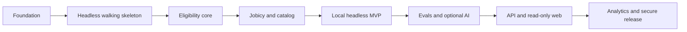

# Borderless Jobs — Delivery Roadmap

Status: approved implementation roadmap  
Last updated: 2026-09-30  
Planning model: dependency-driven milestones; estimates are indicative, not deadlines

## 1. Delivery policy

Development proceeds through independently verifiable increments rather than calendar
weeks. A task is complete only when its behavior, focused quality checks, affected
integration checks, and documentation are green. Agents stop on a failed gate instead
of carrying a red state into later work.

The delivery sequence is:

Detailed tasks, dependencies, estimates, and verification commands belong in
[`development-plan.md`](development-plan.md). This document records delivery intent
and exit gates.

## 2. Non-negotiable priorities

1. Preserve provenance and deterministic eligibility before increasing coverage.
2. Deliver one complete headless journey before adding infrastructure or UI breadth.
3. Keep mandatory operation and tests independent of feeds, models, and credentials.
4. Prefer `UNCERTAIN` to an unsupported permissive verdict.
5. Minimize dependencies and isolate optional AI and observability runtimes.
6. Keep every task small enough to implement, review, and verify independently.
7. Keep all commands and resources safe for concurrent Git worktrees.

## 3. Milestones

### M0 — Reproducible and worktree-safe foundation

Outcome: a clean checkout has one documented, locked, offline-capable Python workflow.

Exit gate:

- Git, Python packaging, linting, typing, testing, secret scanning, and CI are wired;
- PostgreSQL can be started with resources namespaced per worktree;
- migrations can be applied to a disposable database;
- two worktrees can run their fast checks without sharing mutable state;
- dependencies and GitHub Actions follow the supply-chain policy.

Indicative effort: 18–26 hours.

### M1 — Headless walking skeleton

Outcome: synthetic facts produce a versioned JSON report and safe static HTML through
the real CLI and application seams, without a database or network.

Exit gate:

- `borderless search --country BO --role data-engineer` works on synthetic data;
- the report exposes dimensional verdicts, trace, evidence, missing facts, and versions;
- JSON and HTML are deterministic renderings of the same `SearchReport`;
- unsafe content is escaped and contract tests cover exit behavior.

Indicative effort: 18–24 hours.

### M2 — Deterministic eligibility core

Outcome: reviewed geography, engagement, and timezone facts are evaluated by a pure,
versioned engine with protected cases.

Exit gate:

- precedence, contradictions, three-valued composition, and `as_of` semantics pass;
- at least 12 reviewed critical cases are protected;
- property tests cover monotonic restrictions and stable serialization;
- eligibility reaches 90% branch coverage without framework or I/O imports.

Indicative effort: 24–32 hours.

### M3 — Governed ingestion and auditable catalog

Outcome: recorded Jobicy batches and an opt-in live fetch enter PostgreSQL idempotently
with policy, provenance, canonical text, history, and closure state.

Exit gate:

- the source policy has a dated authoritative reference and executable fixtures;
- replay creates no duplicate snapshot or version;
- changed normalized content creates one immutable version;
- evidence offsets target the stored canonical normalized-text version;
- no storage-object abstraction or cross-source fuzzy merge exists.

Indicative effort: 30–40 hours.

### M4 — Local headless MVP

Outcome: a real local search over ingested jobs produces an evidence-backed static
report using deterministic extraction.

Exit gate:

- parsers cover explicit geography, engagement, timezone, salary, and common metadata;
- invalid or contradictory facts become unknown and retain validation diagnostics;
- search, ranking, pagination, reporting, and CLI work against PostgreSQL;
- a database-free exported report remains viewable offline;
- at least 25 reviewed eval cases measure extraction and verdict behavior.

Indicative effort: 36–48 hours.

### M5 — Measured optional intelligence

Outcome: optional providers are compared against the deterministic baseline without
entering the eligibility decision path.

Exit gate:

- an early 4–6 hour Laya spike has a recorded keep/defer decision;
- comparisons use the same frozen cases, schema, slices, and evidence validation;
- ChatGPT plan usage is optional, locally authorized, and securely stored;
- fake adapters cover every error mode in mandatory CI;
- the reviewed corpus grows through 50 cases toward 100 before public release.

Indicative effort: 24–40 hours, excluding optional model specialization.

### M6 — Portfolio interface

Outcome: FastAPI and a read-only Next.js interface expose the proven use cases without
duplicating rules, ranking, or report composition.

Exit gate:

- versioned API routes have stable contracts, structured errors, and query budgets;
- the web interface covers search, filters, results, details, evidence, and methodology;
- no accounts, saved state, or application mutation are introduced;
- one seeded Playwright journey verifies semantic parity with the canonical report;
- runtime logs are correlated and contain neither secrets nor private raw payloads.

Indicative effort: 32–44 hours.

### M7 — Analytics and secure public release

Outcome: a reviewer can reproduce, inspect, and verify the product and its claims.

Exit gate:

- 100 reviewed cases publish precision, coverage, evidence validity, and limitations;
- dbt reports freshness, changes, extraction failures, and verdict coverage only;
- the synthetic Pages demo contains no restricted source payloads;
- CLI and container artifacts include checksums, SBOMs, and build provenance;
- dependency review, scanning, pinned actions, minimum permissions, and release dry-run
  checks pass from a clean checkout;
- backup, restore, migration, and failed-ingestion recovery are rehearsed.

Indicative effort: 28–40 hours.

## 4. Release boundaries

### Headless preview

M0 through M2. It proves the product semantics and canonical artifact without depending
on PostgreSQL, a live feed, or AI.

### Local MVP

M0 through M4. It is useful with real local data and deterministic extraction. This is
the first non-negotiable product boundary.

### Portfolio release

M0 through M7. Optional AI results are reported honestly but do not block the release.
The public demonstration uses synthetic or explicitly reusable data only.

## 5. Scope control

- Defer Remotive, cross-source deduplication, object storage, Prefect, Redis, MCP,
  accounts, API keys, CV/GitHub matching, and hosted API deployment.
- Defer OpenTelemetry, Grafana, and Langfuse until measured operational needs justify
  their dependency and maintenance cost.
- Stop an optional provider experiment when it fails its predeclared quality or resource
  gate; retain the provider-neutral seam and publish the result.
- Add new scope only by removing work of comparable cost from the current milestone or
  moving the new work to a later milestone.

## 6. Definition of completion

A milestone is complete only when every exit condition is demonstrated from a clean
checkout, all mandatory checks run without network or model credentials after dependency
installation, public artifacts contain approved data, and deferred work is recorded
explicitly rather than hidden behind placeholders.
